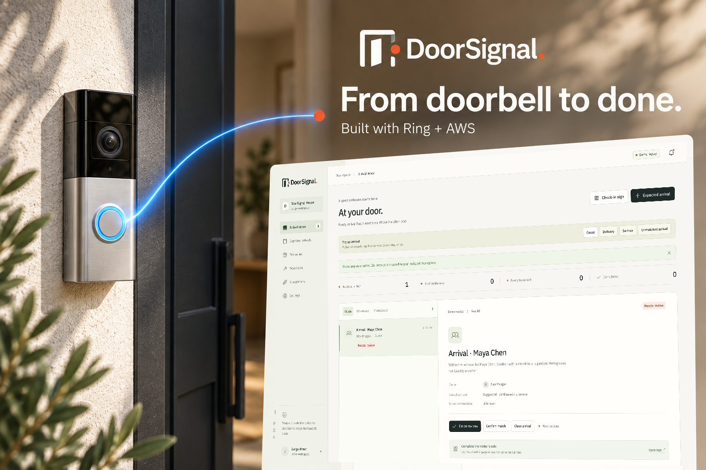
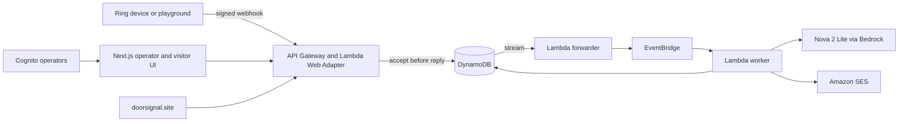

# DoorSignal

**Turn Ring door events into guest, delivery, and service workflows—with clear ownership and no facial recognition.**

[](https://amazonappdev2026.devpost.com/)
[](docs/ARCHITECTURE.md)
[](LICENSE)



DoorSignal gives a small workplace a shared arrival inbox. A signed Ring event becomes a durable case; expected-arrival context and a voluntary QR check-in help the host understand the visit; and an accountable person closes the loop. The judge demo is isolated from live Ring credentials and external email.

## What it demonstrates

- **Guest:** a door event becomes an arrival case, the guest checks in from a printable QR sign, and the host response appears on the guest's phone.
- **Delivery:** a due delivery moves from received to collected with a durable action history.
- **Service or unmatched:** a scheduled visit can be associated tentatively; an after-hours event without context is sent to human review.
- **Live Ring integration:** server-side device discovery, recent event import, signed v1.1 webhooks, and receive-only WHEP session creation and cleanup use `api.amazonvision.com`.
- **AWS intelligence:** Amazon Nova 2 Lite through Bedrock Converse returns bounded, validated coarse scene information. It cannot identify a person or authorize an action.

The system never uses facial recognition. A schedule suggests context; visitor check-in evidence or a human confirms it. Camera bytes stay in memory and are not stored by DoorSignal.

## Architecture



All application records share a site partition. The production store uses DynamoDB transactions and optimistic versions; local development uses a durable JSON file with atomic replacement and an inter-process lock. DynamoDB Streams persist the handoff before EventBridge and worker retries. Failed work goes to SQS.

See [architecture and trust boundaries](docs/ARCHITECTURE.md), [cost controls](docs/COSTS.md), and the [implementation evidence record](docs/IMPLEMENTATION.md).

## Run locally

Prerequisites: Node.js 22+, Corepack, and pnpm 11.

```bash
git clone https://github.com/AmirmLotfy/doorsignal.git
cd doorsignal
corepack enable
pnpm install --frozen-lockfile
cp .env.example .env.local
pnpm dev
```

Open `http://localhost:3000`. Choose **Open the judge demo** to create an isolated fictional workspace. The local durable records and generated signing key are written beneath `.data/`, which is ignored by Git.

Run the full local verification:

```bash
pnpm verify
pnpm infra:synth
pnpm secrets:scan
```

The test suite covers malformed and duplicate Ring deliveries, expired credentials, offline devices, WHEP cleanup, durable processing, site isolation, concurrency, invalid transitions, expired check-ins, model failure, notification retries, and the three demonstration stories.

## Configure live integrations

Deploy the CDK stack in `us-east-1`, then use an operator account in the Cognito `operators` group. Secrets Manager holds the short-lived Ring playground token, webhook secret, expected-arrivals API key hash, and approved SES recipient. Never put these values in environment files or source control.

The expected-arrivals integration accepts a narrowly scoped bearer key:

```http
POST /api/v1/expected-arrivals
Authorization: Bearer dsk_...
Content-Type: application/json

{
  "kind": "GUEST",
  "title": "Portfolio review",
  "owner": "Maya",
  "startsAt": "2026-09-12T10:30:00.000Z",
  "endsAt": "2026-09-12T11:15:00.000Z"
}
```

Live Ring playground sessions are short-lived. When a token expires, DoorSignal shows **Reconnect** and stops making Ring requests. WHEP session URLs are accepted only from the Ring API origin and are deleted explicitly at the end of a view.

The authenticated official Ring Developer Playground was verified on September 10, 2026. Device/account requests succeeded, WHEP creation returned HTTP 201, and cleanup returned HTTP 200. The temporary token and synthetic identifiers were not retained; see the [sanitized evidence record](docs/evidence/ring-playground-2026-09-10.md).

## Deploy to AWS

```bash
aws login
pnpm verify
pnpm package:web
pnpm --filter @doorsignal/cdk deploy --require-approval never \
  --context appUrl=https://doorsignal.site \
  --context certificateArn=YOUR_US_EAST_1_ACM_CERTIFICATE_ARN
```

The deployed stack creates isolated, tagged resources: Lambda, HTTP API Gateway, DynamoDB, EventBridge, SQS, Cognito, Secrets Manager, CloudWatch, SES permissions, SNS, and an AWS Budget. The current account serves the standalone Next.js application and its static assets through Lambda Web Adapter and an API Gateway custom domain. An optional CloudFront/private-S3 mode is available with `--context cloudFrontEnabled=true` for accounts permitted to create distributions. The stack creates no VPC, NAT gateway, relational database, provisioned server, or always-on compute.

The budget measures gross DoorSignal spend from September 10 through November 20, 2026. Alerts fire at US$25 and US$40; application throttles and the account's 10-execution regional Lambda quota limit usage. AWS Budgets is an alerting control, not a hard spending cap.

## Data and access

- Judge sessions use unique `judge:` partitions, expire after one day, and cannot read live accounts, call Ring or Bedrock, or send email.
- Operator controls require a verified Cognito access token and membership in the `operators` group.
- Visitor status links are signed, scoped to one check-in, and expire.
- Live operational records expire after seven days. The Settings page provides an authenticated site-data deletion action.
- Email states mean queued, accepted by SES, or failed. SES acceptance is not represented as inbox delivery.
- Action links open a case; a state-changing request still requires an authenticated click and valid version.

Read the public [privacy explanation](apps/web/src/app/privacy/page.tsx) and [security notes](docs/ARCHITECTURE.md).

## Repository map

```text
apps/web/              Next.js 16 operator, public, and visitor interfaces
packages/core/         Ring, persistence, workflows, auth, Bedrock, SES, workers
infra/cdk/             Reproducible AWS CDK infrastructure
tests/unit/            Contract and workflow verification
assets/brand/          Source brand master and export assets
docs/                  Architecture, evidence, demo, costs, feedback, friction
scripts/               Packaging and secret-scanning utilities
```

## Open source

DoorSignal was created during the Amazon AppDev Challenge 2026 submission period. Source code, infrastructure, test fixtures, documentation, and original brand assets are released under the [Apache License 2.0](LICENSE). Third-party service names and trademarks remain the property of their respective owners.
